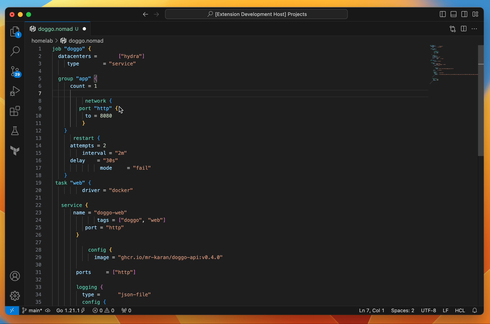

# nomfmt: Nomad Formatter for VS Code

_[Install from VS Code Marketplace](https://marketplace.visualstudio.com/items?itemName=mrkaran.nomfmt)_

`nomfmt` is a Visual Studio Code extension that integrates `nomad fmt` to provide on-the-fly code formatting for Nomad job spec files written in HCL (HashiCorp Configuration Language).

## Requirements

- You must have [`nomad`](https://developer.hashicorp.com/nomad/docs/install) CLI tool installed and available in your system's `PATH`.

## Extension Settings

- `nomfmt.enable`: Enable or disable automatic formatting with `nomfmt`. Default is `true`.

## Supported File Types

`nomfmt` is specifically designed to format `.nomad` and `.nomad.hcl` files. Ensure your job spec files have one of these extensions for the formatter to apply.